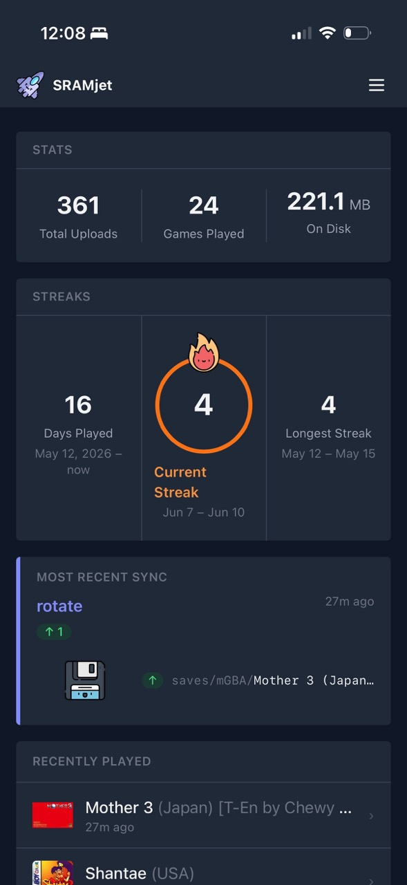
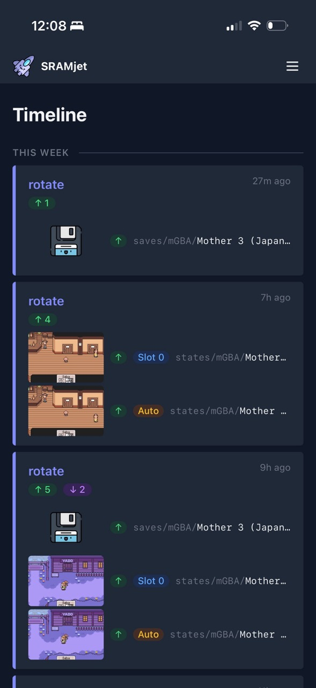
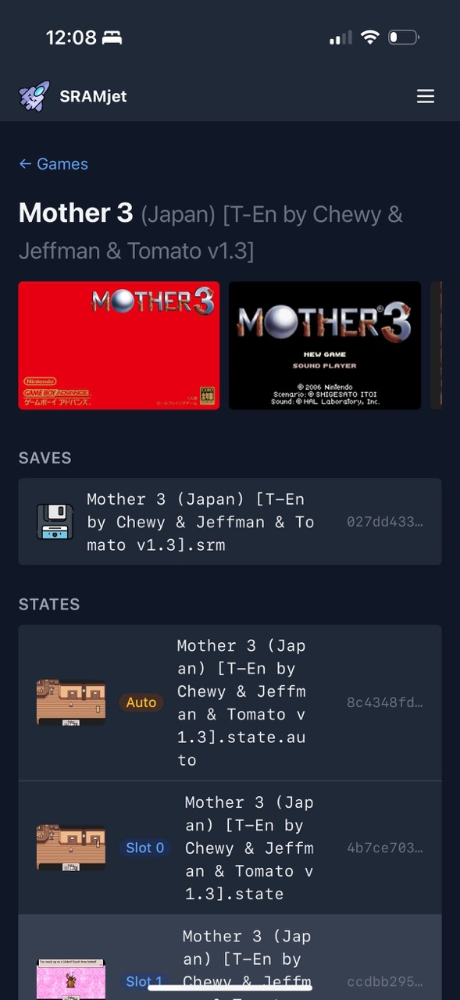

# SRAMjet


A self-hosted sync server for RetroArch's Cloud Sync. Point RetroArch at SRAMjet instead of a generic WebDAV server and get automatic conflict detection, full version history, and a dashboard to browse your saves. Never lose a save file again.

---

## Features

**Sync backend**
- Drop-in WebDAV target for RetroArch Cloud Sync, no additional client-side software needed. Works anywhere RetroArch runs.
- Per-device routing (`/sync/{device-name}/`) with automatic device registration on first sync
- Last-write-wins conflict resolution: uploads are always accepted with full version history kept for revert
- Content-addressable storage: identical files are stored exactly once regardless of how many devices upload them
- Full version history with configurable retention limits per file category (saves, states, system, thumbnails)
- File-level revert to any previous version from the dashboard
- Per-device quarantine to isolate saves or states to a single device (useful for incompatible emulator cores)

**Dashboard**
- A full visual interface to your saves: browse games with boxart, see version history over time, revert any file to a previous version, and monitor sync activity across devices

**Pinned saves**
- Pin any version of a save or state with an optional note (e.g. "Before final boss")
- Pinned versions are kept indefinitely regardless of retention limits
- Easily download or revert to your pinned saves from the web dashboard

**Security**
- Optional HTTP Basic auth for the web UI and WebDAV sync endpoints, configured independently via environment variables
- Auth is disabled by default; run it on a local network or secure it with Tailscale, Cloudflare Access, or similar

---

## Screenshots

<p>
  
  
  
</p>

---

## Quick Start (Docker)

Download the compose file and start the container:

```bash
curl -O https://raw.githubusercontent.com/raygan/sramjet/main/docker/docker-compose.yml
docker compose up -d
```

The dashboard is available at `http://your-server:8080`.

Data is stored in a `./data` folder next to your compose file. To change the path, edit the volume in `docker-compose.yml`:

```yaml
volumes:
  - /path/to/your/data:/data
```

**Environment variables**

| Variable | Default | Description |
|---|---|---|
| `DATA_DIR` | `/data` | Where the database, blobs, and manifests are stored |
| `DISPLAY_TZ` | `UTC` | Timezone for dashboard timestamps |
| `SYSTEM_VERSION_LIMIT` | `5` | Versions to keep for `system/` files |
| `THUMBNAIL_VERSION_LIMIT` | `3` | Versions to keep for `thumbnails/` files |
| `SAVES_VERSION_LIMIT` | `0` | Versions to keep for `saves/` files (`0` means unlimited) |
| `STATES_VERSION_LIMIT` | `0` | Versions to keep for `states/` files (`0` means unlimited) |
| `SYNC_EVENT_WINDOW_SECONDS` | `30` | Events within this window from the same device are merged |
| `MAX_UPLOAD_BYTES` | `268435456` | Maximum file upload size in bytes (256 MB); `0` disables the limit |
| `AUTH_UI_USERNAME` | *(unset)* | Username for web UI and API (both vars must be set to enable) |
| `AUTH_UI_PASSWORD` | *(unset)* | Password for web UI and API |
| `AUTH_WEBDAV_USERNAME` | *(unset)* | Username for WebDAV sync (both vars must be set to enable) |
| `AUTH_WEBDAV_PASSWORD` | *(unset)* | Password for WebDAV sync |

---

## RetroArch Setup

In RetroArch, go to **Settings → Saving → Cloud Sync** and set:

| Setting | Value |
|---|---|
| Cloud Sync Backend | WebDAV |
| Cloud Sync URL | `http://your-server:8080/sync/my-device-name/` |

Use a different device name for each device (e.g. `iphone`, `ipad`, `mac`). SRAMjet registers new devices automatically on first sync, no server-side setup needed.

For a full setup walkthrough and conflict resolution tips, see the **Help** page in the dashboard.

---

## Development

```bash
pip install -e ".[dev]"
DATA_DIR=./data uvicorn app.main:app --reload --host 0.0.0.0 --port 8080
```

> `--host 0.0.0.0` is required if you want real devices to reach the dev server. Without it uvicorn binds to localhost only and RetroArch on other devices will fail silently.

```bash
pytest
```

See [CONTRIBUTING.md](CONTRIBUTING.md) for architecture notes, the schema migration workflow, and dashboard conventions.

---

## Attribution

Icons by [Freepik](https://www.flaticon.com/authors/kawaii/lineal-color) on Flaticon.
